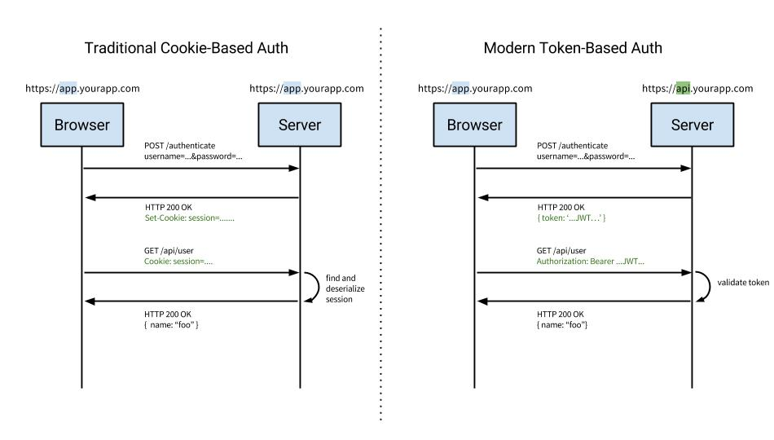

# JWT 인증 API를 만들어보자.

## 만들 기능

1. /auth : 세션 토큰 발급받기 
2. /join : 회원가입하기
3. /login : 로그인

# 선행지식 Claim , OAuth 토큰에 대해서 

### Claim 기반 토큰의 개념
OAuth 에 의해서 발급되는 access_token은 random string 으로 토큰 자체에는 특별한 정보를 가지고 있지 않는 일반적인 스트링 형태이다. 아래 이미지는 Facebook에서 발급된 access_token의 형태로 일반적인 문자열 형태임이다. 

**Claim 기반의 토큰은** API나 서비스를 제공하는 서버 입장에서(권한발급) 그 access_token을 통해서 사용자에 연관된 권한(예를 들어 scope)을 식별한 뒤 권한을 허용해주는 방식.

즉 서비스를 제공하는 입장에서 토큰을 자기오 그 토큰과 연관된 정보를 서버쪽에서 찾아야 한다.(사용자 ID값이나 권한 등..)

Claim은 토큰 자체가 정보를 가지고 있는 형태이며, JSON자체를 토큰으로 사용하는 방식이 바로 Claim이다. 

# 토큰(Token)기반 인증 
토큰 기반 인증은 모던 웹 서비스에서 많이 사용되고 잇다.
API를 사용하는 웹 서비스를 개발한다면 토큰을 사용하여 유저들의 인증 작업을 처리하는것이 가장 좋은 방법이 된다.
토큰 기반 인증 시스템을 선택하는 이유는 

1. stateless서버
2. 모바일 어플리케이션에 적합, 
3. 인증정보를 다른 어플리케이션으로 전달
4. 보안성 

4가지의 대표적인 이유가 있다. 

**stateless**

stateless 서버를 이해하기 위해서는 Stateful 서버가 무엇인지 알아야한다. Stateful서버는 클라이언트에게서 요청을 받을 때 마다, 클라이언트의 상태를 계속해서 유지하고, 이 정보를 서비스 제공에 이용할 수 있어야 한다.

stateful 서버의 예제로는 세션을 유지하는 웹 서버가 있다. 
이 정보는 서버컴퓨터의 인메모리, 캐쉬, 데이터베이스에 저장하기도 한다.

stateless 서버는 상태를 우지하지 않는다. 상태정보를 저장하지 않으면 서버는 클라이언트 측에서 들어오는 요청만으로만 작업을 처리한다. 이렇게 상태가 없는 경우 클라이언트와 서버의 연결고리가 없기 때문에 서버의 **확장성(Scalability)**이 높아지게됩니다.

**모바일어플리케이션에 적합하다**

만약에 Android/iOS 모바일 어플리케이션을 개발한다면, 안전한 API를 만들기 위해서 쿠키같은 인증시스템은 이상적이지 않습니다. (모바일 기기의 어플리케이션 resume 상태로 돌입해 만료가 되거나 네트워크의 변경 등, 이 경우에는 쿠키 컨테이너를 사용해야한다.) 토큰 기반 인증을 도입한다면, 더욱 간단하게 이 번거로움을 해결 할 수 있습니다.

**인증정보를 다른 어플리케이션으로 전달**
OAuth가 대표적인 사례, 다른 웹 서비스에서도 로그인 할 수 있게 한다.

**보안**
토큰 기반 인증 시스템을 사용하여 어플리케이션의 보안을 높일 수 있다. 단, 토큰 기반 인증을 사용한다고 해서 해킹의 위협에서 벗어 날 수 있는건 아님.

# 토큰 기반(stateless) 서비스를 이용하는 서비스

트위터, 페이스북, 깃헙, 구글

# 서버 기반(stateful) 인증

기존의 인증 시스템에서는 서버측에서 유저들의 정보를 기억하고 있어야 한다.
이 세션을 유지하기 위해서는 여러가지 방법이 있다.
메모리, 디스크(파일), 데이터베이스 시스템이 이를 이야기한다.

이런 방식의 인증시스템은 아직도 많이 사용 되고 있다. 하지만 웹/ 모바일 웹 어플리케이션들이 트랜디 하게 되면서
이런 방식의 인증 시스템이 문제가 되기 시작하고있습니다. 바로 서버확장성에 있어서 말이죠.

# 서버기반의 인증(stateful)의 문제점

#### 세션 

유저가 세션을 인증할 때, 서버는 이 기록을 서버에 저장을 해야한다.
이것을 **세션**이라고 한다. 대부분의 경우엔 메모리(RAM,Disk[file])에 저장하는데, 로그인 중인 유저의 수가 늘어난다면 어떻게 해야할까요? 이를 피하기 위해서, 세션을 데이터베이스 시스템에 저장하기도 하지만 유저수가 100만이라면 성능에 무리가 될 수 있습니다.

#### 확장성

세션을 사용하면 서버를 확장하는것이 어려워지게 됩니다.

서버확장이란 기능이나 사양을 업그레이드 하는것이 아닌 여러개의 프로세스를 돌리거나
여러개의 도메인을 가진 별도의 서버를 의미합니다. 분산된 시스템을 설계하는건 불가능한것은 아니지만
과정이 매우 복잡하게 됩니다.

#### CORS(Cross-Origin Resource Sharing)
웹 어플리케이션에서 세션을 관리 할 때 자주 사용되는 쿠키는 단일도메인 및 서브 도메인에서만 작동하도록 설계되어있습니다.
따라서 쿠키를 여러 도메인에서 관리하는것은 번거롭고 어렵습니다.

# 토큰 기반 시스템의 작동원리

토큰 기반 시스템은 stateless합니다. 무상태, 즉 상태유지를 하지않는것이 특징입니다.

이 뜻은, 시스템에서는 더 이상 유저의 인증 정보를 서버나 세션에 담아두지 않는다는 뜻입니다.

이 개념 하나만으로도 "서버에서 유저의 인증 정보를 서버측에 담아둠"으로써 발생하는 많은 문제점들이 해소 됩니다.

세션이 존재하지 않으니 유저들이 로그인 되어있는지 안되어있는지 신경 쓰지 않으면서 서버를 쉽게 확장할 수 있게됩니다.

세션이 존재하지 않으니, 유저들이 로그인 되어있는지 안되어있는지 신경쓰지 않으면서 서버를 손쉽게 확장 할 수 있게 됩니다.

토큰 기반 시스템의 구현방식은 시스템마다 크고작은 차이가 있지만.. 대략적으로는 다음과 같은 Sequence를 따릅니다

1. 유저가 아이디와 비밀번호로 로그인을 합니다.
2. 서버측에서 해당 계정정보를 검증합니다.
3. 계정정보가 정확하다면, 서버측에서 유저에게 signed 토큰을 발급해줍니다.
     - signed의 의미는 해당 토큰이 서버에서 정상적으로 발급된 토큰임을 증명하는 signature를 지니고 있다는 뜻.

4. 클라이언트 측에서 전달받은 토큰을 저장해두고, 서버에 요청을 할 때 마다 **해당 토큰을 함께 서버에 전달**합니다.
5. 서버는 **토큰을 검증** 하고, 요청에 응답합니다.

웹 서버에서 토큰을 전달 할 때에는, HTTP요청의 헤더에 토큰값을 포함시켜서 전달합니다.

# 토큰의 장점

**무상태(stateless), 확장성(scalability)**.

이 개념에 대해서는 두 번 이상 강조해도 부족함이없을 정도입니다.

토큰은 클라이언트 사이드에 저장하기 때문에 stateless하며, 서버를 확장하기에 적합한 환경을 제공합니다.
만약에 세션을 서버측에 저장하고있고, 서버를 여러대를 사용하여 요청을 분산하였다면, 어떤 유저가 로그인을 했을땐, 
그 유저는 처음 로그인 했었던 서버에만 요청을 보내도록 설정을 해야합니다.

하지만 토큰을 사용한다면, 어던 서버로 요청이 들어가던 이제 상관이 없게 됩니다.

**보안성**

클라이언트가 서버에 요청을 보낼 떄, 더 이상 쿠키를 전달하지 않음으로 쿠키를 사용함으로 인해 발생하는 취약점이 사라지게 됩니다. 하지만 토큰을 사용하는 환경에서도 취약점이 존재할 수 있으니 언제나 취약점에 대해 대비해야합니다.

**확장성(Extensibility)**
여기서 확장성은 Scalability와 또 다른 개념으로 Scalability는 서버를 확장하는것을 의미하는 반면,
Extensibility는 로그인 정보가 사용되는 분야를 확장하는것을 의미합니다. 
토큰을 사용해 다른 서비스에 서도 권한을 공유할 수 있습니다. 스타트업 구인 구직 웹 서비스인 로켓펀치에서는 Facebook, LinkedIn, Github, Google 계정으로 로그인 할 수 있습니다. 토큰 기반 시스템에서는, 토큰에 선택적인 권한만을 부여하여 발급할 수 있습니다. 

**여러플랫폼 및 도메인**
서버 기반 인증 시스템의 문제점을 다룰 때 CORS에 대하여 언급했었는데, 어플리케이션과 서비스의 규모가 커지면,
여러 디바이스를 호환 시키고 더 많은 종류으 서비스를 제공하게 됩니다. 토큰을 사용한다면, 그 어떤 디바이스에서도, 그 어떤 도메인에서도, 토큰만 유효하다면 요청이 정상적으로 처리 됩니다. 서버측에서 어플리케이션의 응답부분에 헤더만 포함시켜주면 됩니다. 

> Access-Control-Allow-Origin: *

이런 구조라면 assets 파일들(이미지, css, js ,html 파일 등)은 모두 CDN 에서 제공하도록 하고
서버측에서는 API만 다루도록 설계할 수 있게 됩니다.

**웹 표준 기반**
토큰 기반 인증 시스템의 구현체인 JWT는 웹 표준 RFC 7519에 등록되어있습니다.
따라서 여러 환경에서 지원이 되며 수많은 회사의 인프라스트럭쳐에서 사용되고 있습니다.

# Reference

1. [Stateless vs Stateful Servers](http://orca.st.usm.edu/~seyfarth/network_pgm/net-6-3-3.html)
  - Stateful Server는 다음요청에 사용자의 정보를 가지고있는것을 말한다.
  - Stateless Server는 정보의 상태를 가지고있지 않다.
  - 무상태의 파일서버를 사용할 때, 클라이언트는 반드시 특별한 파일 이름을 각각 특정 경로가 담긴 요청에 실어 보내야한다 
  읽거나 쓰기를 할 때도 말이다.
  - stateful file server는 클라이언트는 데이터 입력 없이 요청을 보낼 수 있다.
  - stateful server 는 매우 간단하다. 
  - 반면 stateless server 는 존나 복잡해서 커넥션을 읽어도 파일이나 상태가 떠나지 않는다.
  - 서버를 재 종료해도 데이터는 유실되지 않으며, 클라이언트가 재 종료를 해도 서버는 세션에 대한 유효를 헷갈리지 않는다.
  
2. [Cookies vs Tokens. Getting auth right with Angular.JS](https://auth0.com/blog/angularjs-authentication-with-cookies-vs-token/) [예제 있음]
  - 전통 쿠키 인증방식과, 현대의 토큰 기반 인증방식의 차이.jpg
     
  - CORS면에서 쿠키인증은 다른 서버가 다른 도메인일경우 유효하지 않게 되는데 토큰은 그런것과 상관없다.
  - CSRF iframe을 제외하고, 쿠키를 사용하지 않음으로써 CSRF 공격으로부터 자유로워 질 수 있다.
  - Stateless는 세션저장소를 사용하지 않고, 클라이언트 사이드영역에서 저장소를 운영한다.
  - CDN 어플리케이션에 대한 자원(html, css, js, images)이 서버사이드에 있다고 하면 그저 API url로 요청하면 된다.
  - Decoupling: 토큰인증은 어느 서버에서도 이용 가능하다. 모든 서버마다 인증방식을 구현할 필요는 없다.
  - Mobile Ready: 모바일기기가 종료되거나 인터넷이 바뀌어도 토큰세션은 만료가 되지 않는다.
  - Persomance: 아무래도 네트워크 연결시간때문에 HMAC SHA256 (기존의 쿠키세션방식)보다 시간이 더 걸릴 수 있다.
  - Standard-based: JWT(JSON Web Token)는 이제 웹 표준으로 받아들여졌으며 각종 라이브러리에서도 이를 적용해서 사용하고 있다.

3. [확장성 있는 웹 아키텍처와 분산 시스템](http://d2.naver.com/helloworld/206816)
  - (과제)

4. [What is token based authentication?](http://stackoverflow.com/questions/1592534/what-is-token-based-authentication)
  -2번 자료의 내용과 중복 
   
5. [REST API의 이해와 설계 #1-개념 소개](http://bcho.tistory.com/953)
  - (REST API 글 본문 전부 과제)
  - 기본적인 RESTful URL 설계 가이드라인 에 대해 잘 나와있음 한번 살펴보도록 하자. 
  - URL 설계할때 참고하자.

6. [The Ins and Outs of Token Based Authentication](https://scotch.io/tutorials/the-ins-and-outs-of-token-based-authentication#introduction)

7. [Token-based authentication: security considerations](http://www.kieranpotts.com/blog/token-authentication-security)

# [다음](./next.md)